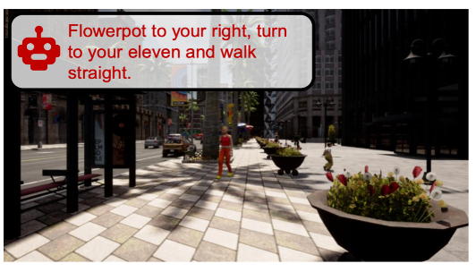

I am currently a M.S. in Electrical and Computer Engineering student at [Boston University](https://www.bu.edu), working with [Prof. Eshed Ohn-Bar](https://eshed1.github.io) on computer vision, robotics and machine learning with their applications in autonomous and assistive systems.

Prior to BU, I worked as an algorithm engineer for an autonomous driving start up. And before that, I got my bachelor's degree from [The University of Hong Kong](https://www.hku.hk), where I majored in Decision Analytics (combination of statistics and computer science), and minored in Mathematics.

I am currently looking to apply for PhD in the comming academic year.

## Research

<table style="border: none; border-collapse: collapse;" border="0">
  
<tr style="border-collapse: separate; border-spacing:30em;">
<td style="border-collapse: collapse; border: none;">
 </td>
  
 
<td style="border-collapse: collapse; border: none;">
<b>ASSISTER: Assistive Navigation via Conditional Instruction Generation</b>
 
<b>Zanming Huang</b>*, Zhongkai Shangguan*, Jimuyang Zhang, Gilad Bar, Matthew Boyd, Eshed Ohn-Bar 

<i>European Conference on Computer Vision (ECCV)</i>, 2022
 
<a href="https://eshed1.github.io/papers/assister_eccv2022.pdf">[Paper]</a> |
<a href="https://github.com/h2xlab/ASSISTER">[Github]</a>
</td>
</tr>  
  
</table>

<!--End of Research table-->

