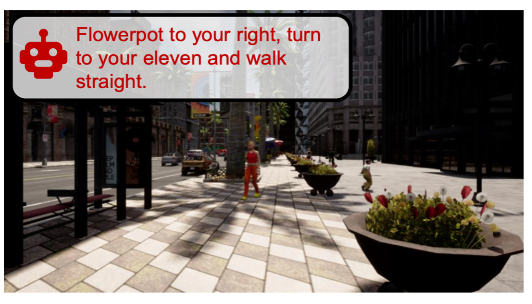


  You can also find my articles on <u><a href="{{author.googlescholar}}">my Google Scholar profile</a>.</u>


## Conference Papers

<table style="border: none; border-collapse: collapse;" border="0">

<!--CAT-->

<tr style="border-collapse: separate; border-spacing:30em;">
<td style="border-collapse: collapse; border: none;">
 </td>
  
 
<td style="border-collapse: collapse; border: none;">
<b>Coaching a Teachable Student to Drive</b>
(Under Review)
 
Jimuyang Zhang, <b>Zanming Huang</b>, Eshed Ohn-Bar 

<i>Conference on Computer Vision and Pattern Recognition (CVPR)</i>, 2023
 
<a href="https://eshed1.github.io/papers/assister_eccv2022.pdf">[Paper]</a> |
<a href="https://github.com/h2xlab/ASSISTER">[Github]</a>
</td>
</tr> 

<!--ASSISTER-->

<tr style="border-collapse: separate; border-spacing:30em;">
<td style="border-collapse: collapse; border: none;">
 </td>
  
 
<td style="border-collapse: collapse; border: none;">
<b>ASSISTER: Assistive Navigation via Conditional Instruction Generation</b>
 
<b>Zanming Huang</b>*, Zhongkai Shangguan*, Jimuyang Zhang, Gilad Bar, Matthew Boyd, Eshed Ohn-Bar 

<i>European Conference on Computer Vision (ECCV)</i>, 2022
 
<a href="https://eshed1.github.io/papers/assister_eccv2022.pdf">[Paper]</a> |
<a href="https://github.com/h2xlab/ASSISTER">[Github]</a>
</td>
</tr>  

</table>

## Patents

- **"Obstacle Processing Method and Device and Traveling Equipment"**, Chinese Patent, Filed on Apr. 09 2021 (Application No. CN202110381578.6A), Issued on Oct. 14 2022 (Patent No.CN113022593B)
- **"Formation Vehicle Driving Method and Device, Computer Equipment and Storage Medium"**, Chinese Patent, Filed on Aug. 13 2020 (Application No. CN202010812105.2A), *Patent Pending*
- **"Control Method, Device, Equipment and Storage Medium for Formation Vehicles"**, Chinese Patent, Filed on Dec. 02 2020 (Application No. CN202011392833.9A), *Patent Pending*